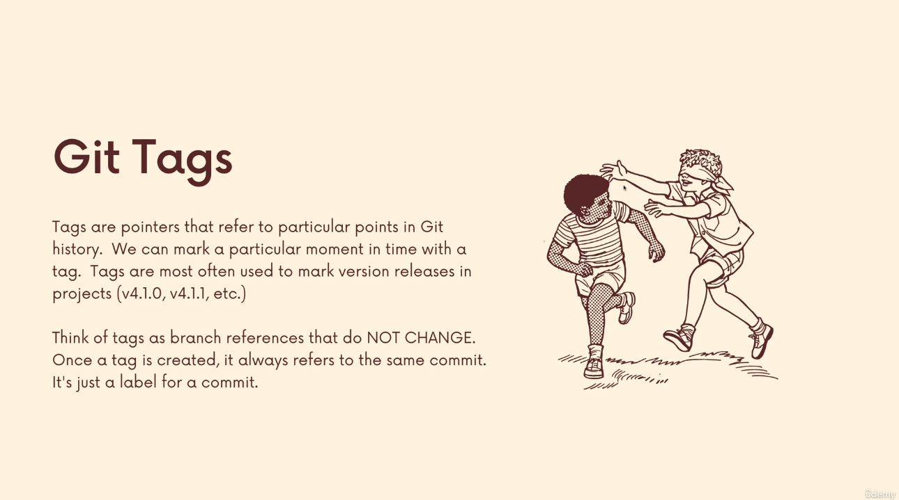

# Section 17

## **154)**

### **[Slides for this section](https://www.canva.com/en_gb/login/?redirect=%2Fdesign%2FDAEV5aEpUOQ%2FlfUIjJz2atC6fGT9KOv2kg%2Fview%3Futm_content%3DDAEV5aEpUOQ%26utm_campaign%3Ddesignshare%26utm_medium%3Dlink%26utm_source%3Dpublishsharelink)**

## **155)**

### **tags**

>perdoret psh me kallzu cili verzion o

### **llojet e tags**
>lightweight tags
>
>jon veq emra ose labels

>annotadet tags
>
>ka data ekstra si psh
>
>emri autorit , email, tagging message, tha date

## **156-158)**

### **[Semantic Versioning](https://semver.org/)**

### **[bootstrap releases](https://getbootstrap.com/docs/versions/)**

### **[react relases](https://legacy.reactjs.org/versions/)**

### **git tag**
>i printon kejt tags qe jan  nrepo

### **git tag -l "name"**
>i printon kejt tags permbajn qet Name, dmth i bon filter

### **git checkout tag**
>e kqyr tagin, psh
>
>git checkout 17.2.1

### **git fig v5.1.4 v5.2.5**
>diferenca mes tags

## **159)**

### **git tag tagName**
>e shton ni lightweight tag

## **160)**

### **git tag -a tagName**
>e shton ni annotated tag
>
>te kjo mujna me lan koment

## **161)**

### **git tag tagName commitName**
>mujna me tag ni specific komit

## **162)**

### **git tag -f tagName**
>mujna me force ni tag
>
>perdoret me reuse a tag nese already osht

## **163)**

### **git tag -d tagName**
>per me delete ni tag

## **164)**

### **git push --tag**
>per me i push kejt tags
>
>IMPORTANT

### **git push tagName**
>per me e push ni tags specifik
