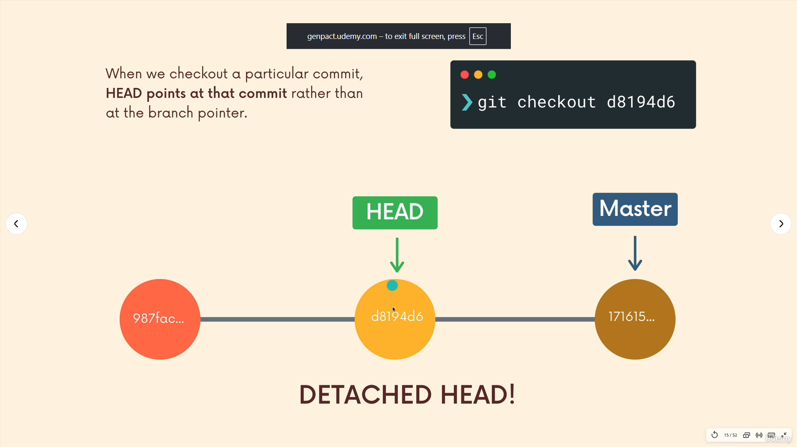
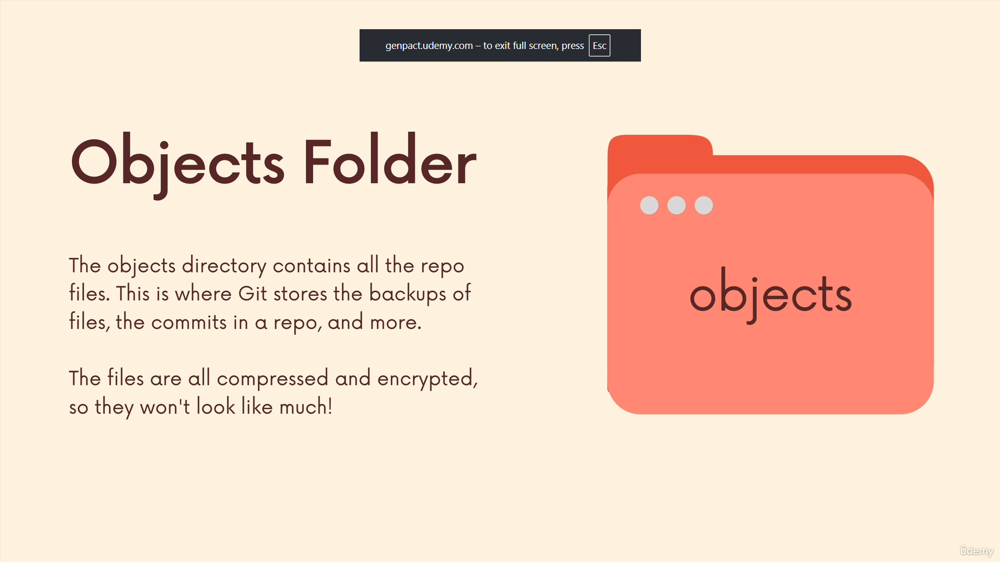
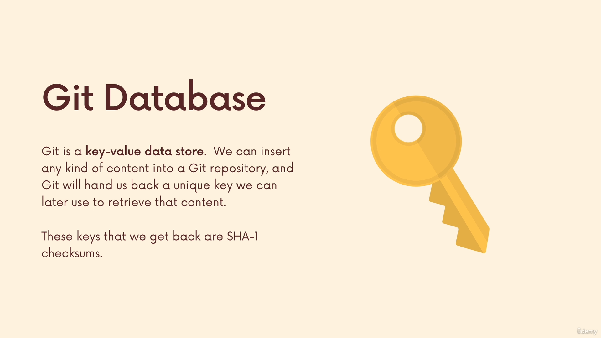
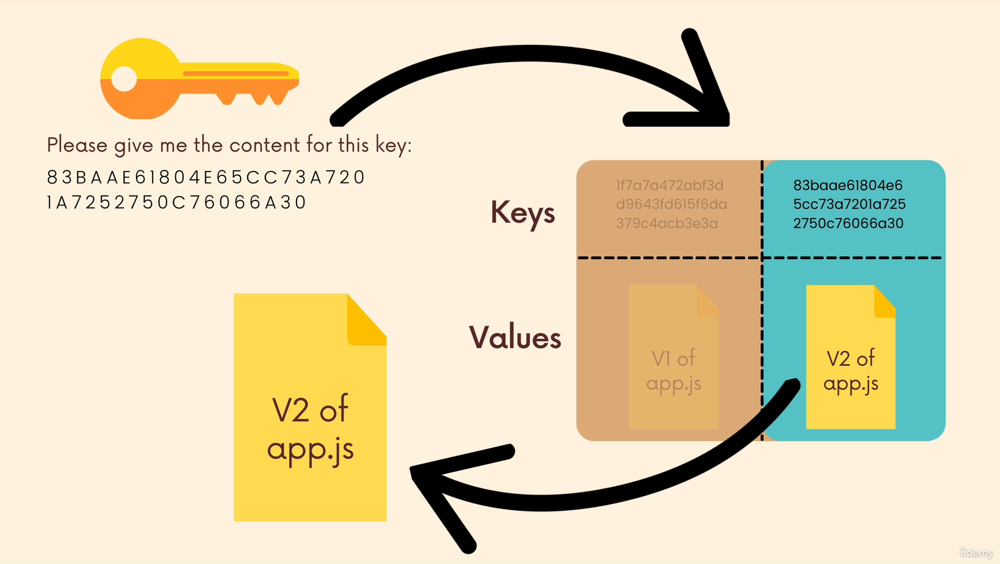
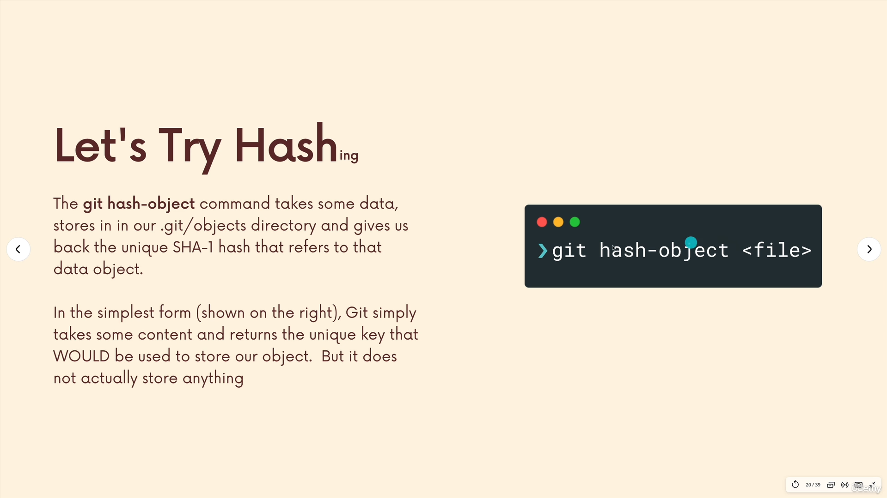
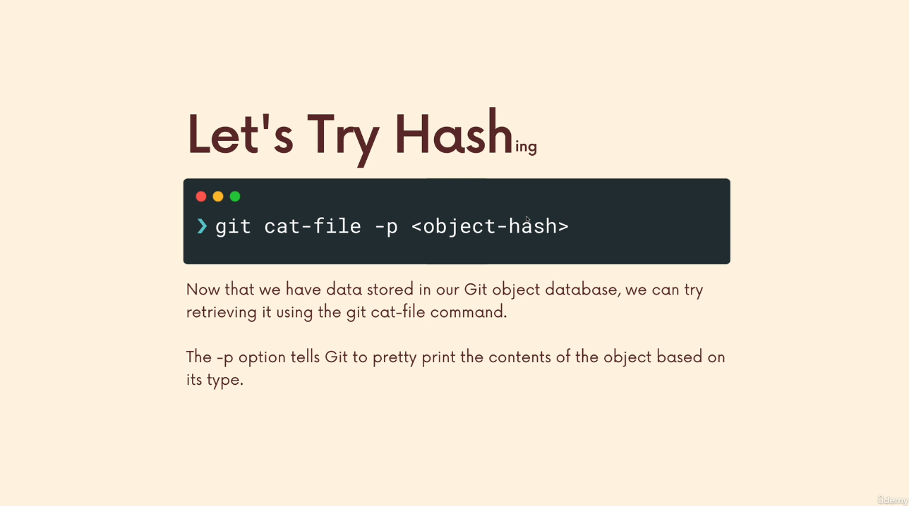
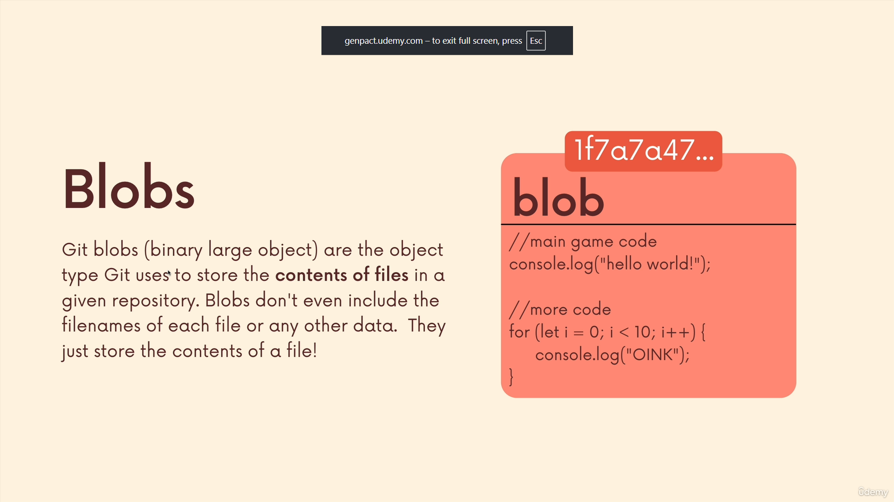
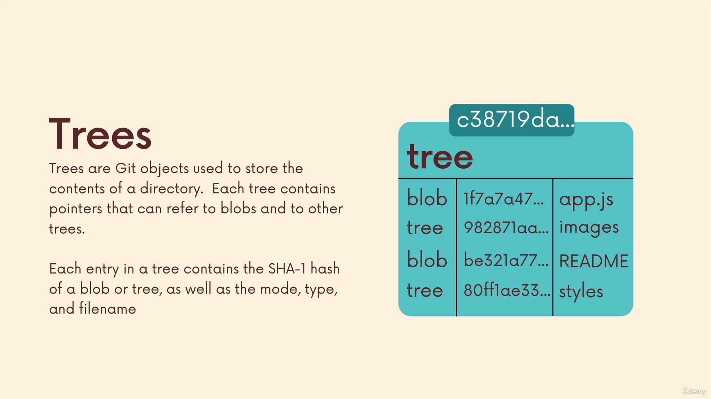
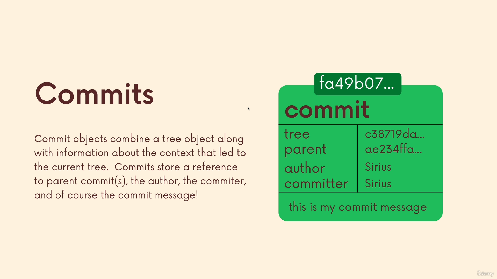

# Section 18

## **165)**

### **[Slides for this section](https://www.canva.com/en_gb/login/?redirect=%2Fdesign%2FDAEV-h9bSG4%2FR6FyldDe8CO8Wfn8z92yRA%2Fview%3Futm_content%3DDAEV-h9bSG4%26utm_campaign%3Ddesignshare%26utm_medium%3Dlink%26utm_source%3Dpublishsharelink)**

## **166)**
### **[git config docs](https://git-scm.com/docs/git-config)**

### **config**
 

### **git config --local user.name userName**
>shto emrin nese ska per local

### **git config --local user.email userEmail**
>shto email nese ska per local

### **config file**
>me qeta mujm mi ndrru configat psh ngjyrat e sene per local

## **167)**

### **refs folder**

 

>te refs i ki branch hash edhe kejt senet tjera
>
>dmth jon
>
>heads,remote,tags

## **168)**

### **head file**

 

 

## **169)**

### **objects folder**
 

### **4 lloje te git objects**
>commit
>
>tree
>
>blob
>
>annotated tags

## **170)**

### **[Sha-1 Demo](https://linkgod.github.io/SHA-1/)**

## **171)**

### **git database**

 

 

### **[git hash-object docs](https://git-scm.com/docs/git-hash-object)**

### **git hash-object fileName**
 

### **per me hash ni echo**
>echo "hello" | git hash-object --stdin
>
>per me store
>
>echo "hello" | git hash-object --stdin -w

## **173)**

### **[git cat docs](https://git-scm.com/docs/git-cat-file)**

### **lets try hash**
 

### **git cat-file -p hashCode**
>e kthen n normal

## **174)**

### **blobs**

## **175)**

### **trees**

### **fit cat-file -p master^{tree}**
>viewing trees

## **176)**
### **commits**

