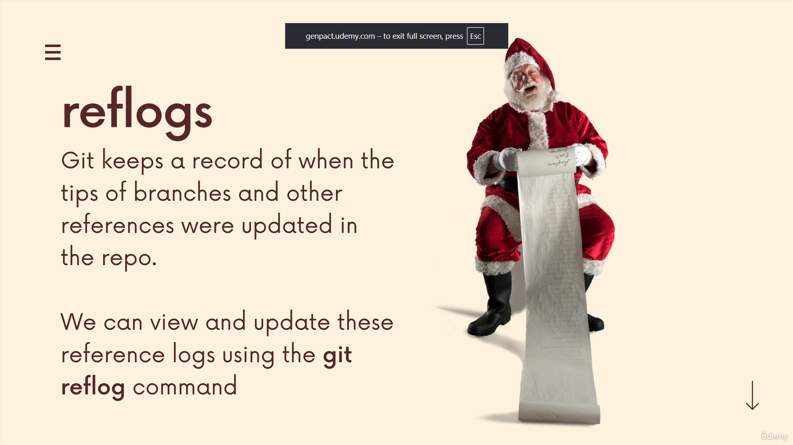
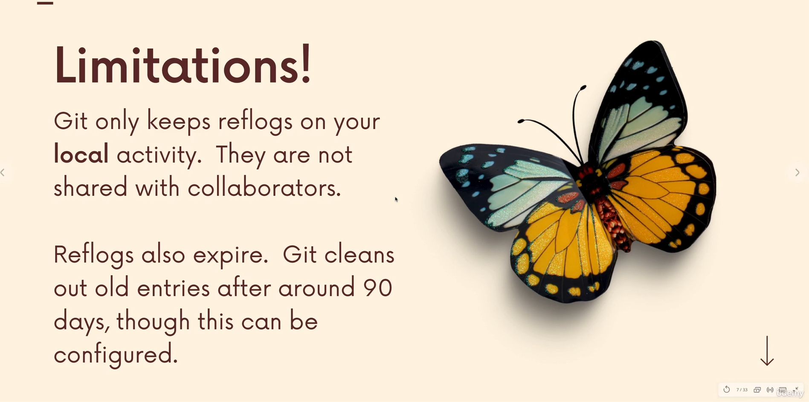
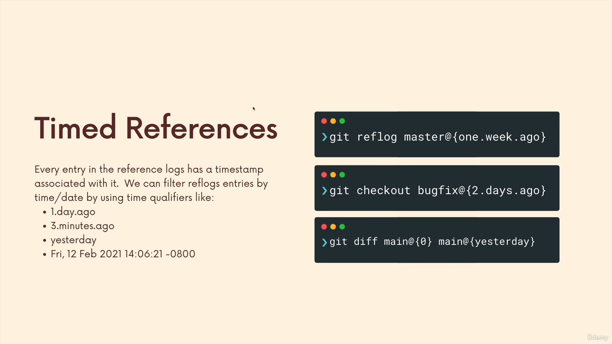

# Section 19

## **177)**

### **[slides for this section](https://www.canva.com/design/DAEWorNx5_Q/ZV41CNnJtCHk2-1ESEWt1A/view?utm_content=DAEWorNx5_Q&utm_campaign=designshare&utm_medium=link&utm_source=editor)**

### **reflogs**

### **limitations**

## **180)**

### **[git reflog docs](https://git-scm.com/docs/git-reflog)**

### **git reflog show HEAD**
>head ose main ose ....
>git reflog show -> by default shows HEAD

## **181)**

### **name@{qualifier}**
>per specific ref point

## **182)**

### **timed references**

## **184)**

### **gi reset --hard hash**
>per me undo ni rebase
