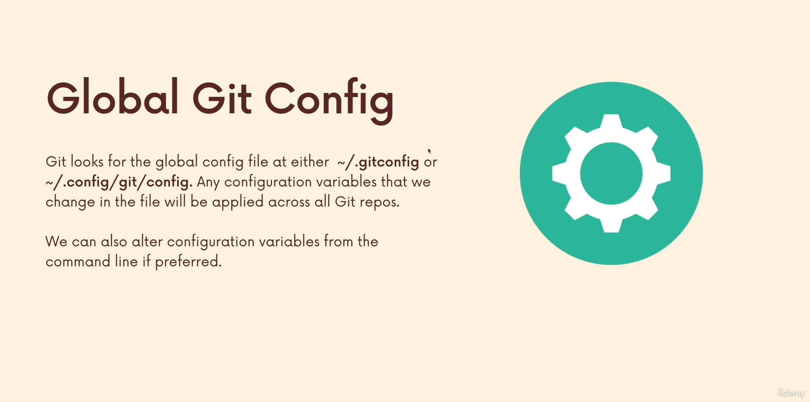
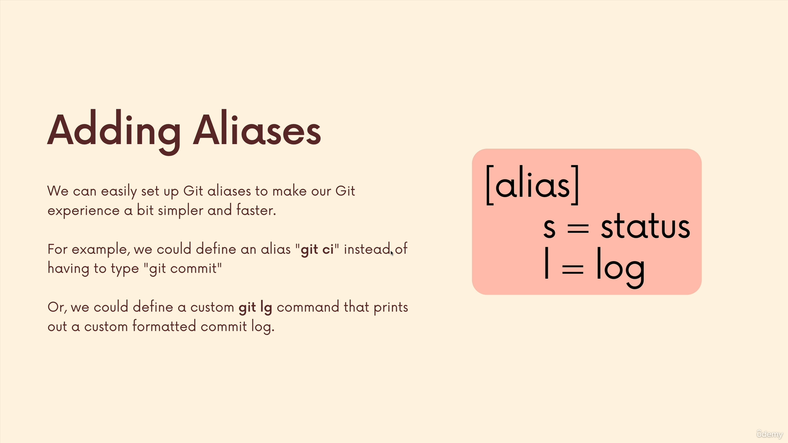

# Section 20

## **185)**

### **[Slides for this section](https://www.canva.com/en_gb/login/?redirect=%2Fdesign%2FDAEWcidQeSI%2Fm6VuuSGBgvBNsRcxfweqDA%2Fview%3Futm_content%3DDAEWcidQeSI%26utm_campaign%3Ddesignshare%26utm_medium%3Dlink%26utm_source%3Dpublishsharelink)**

## **189)**

### **global git config**

## **187)**

### **adding aliases**

## **190)**

### **[git alias github repo](https://github.com/GitAlias/gitalias)**

### **[git alias blog](https://www.durdn.com/blog/2012/11/22/must-have-git-aliases-advanced-examples/)**

### **[the ultimate git alias setup](https://gist.github.com/mwhite/6887990)**
